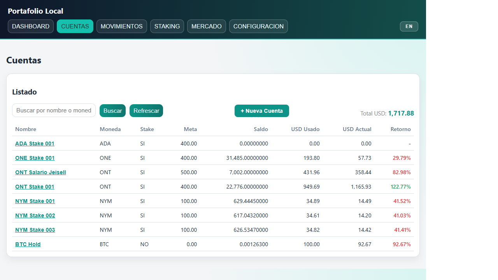
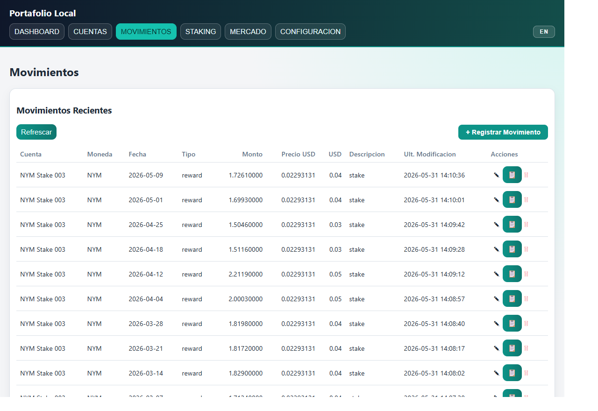
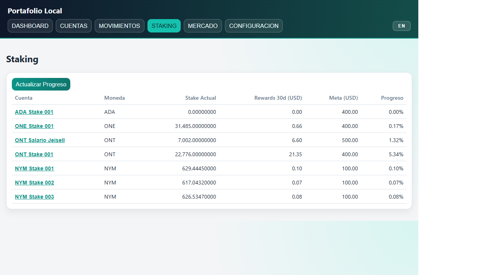
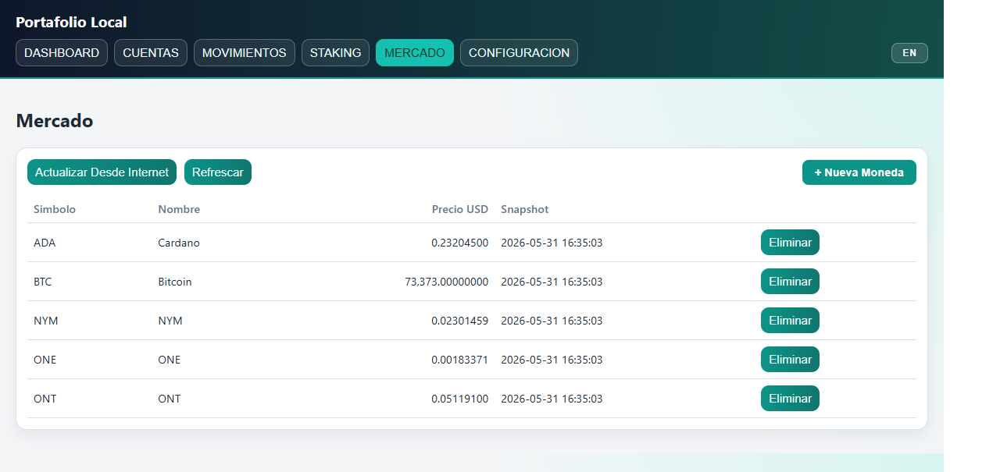
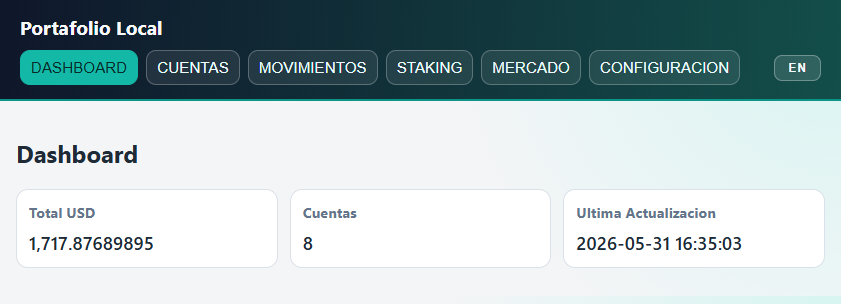
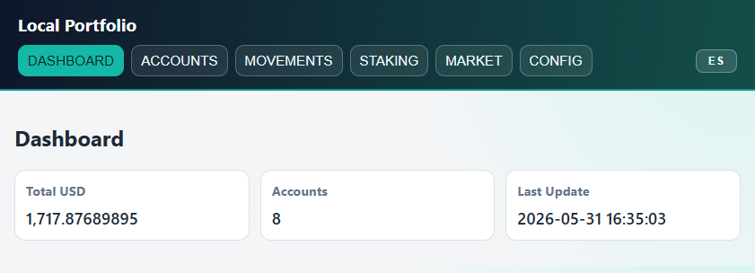

# Crypto Portfolio Manager

> Herramienta local para seguimiento de criptomonedas y activos fiat con interfaz web y CLI. Sin dependencias externas, todo corre en tu propia máquina.


---

## Tabla de Contenidos

- [Crypto Portfolio Manager](#crypto-portfolio-manager)
  - [Tabla de Contenidos](#tabla-de-contenidos)
  - [¿Qué es esto?](#qué-es-esto)
  - [Funcionalidades](#funcionalidades)
  - [Stack Tecnológico](#stack-tecnológico)
  - [Requisitos](#requisitos)
    - [Instalar uv (opcional pero recomendado)](#instalar-uv-opcional-pero-recomendado)
  - [Setup](#setup)
    - [Con uv (recomendado)](#con-uv-recomendado)
    - [Sin uv (Python estándar)](#sin-uv-python-estándar)
  - [Quick Start](#quick-start)
  - [Screenshots](#screenshots)
  - [Uso — Interfaz Web](#uso--interfaz-web)
    - [Secciones disponibles](#secciones-disponibles)
  - [Estructura del Proyecto](#estructura-del-proyecto)
  - [Ejecutar Tests](#ejecutar-tests)
  - [Limitaciones](#limitaciones)
  - [Licencia](#licencia)

---

## ¿Qué es esto?

Un sistema personal de seguimiento de portafolio que corre completamente en local. Gestiona cuentas, registra movimientos de entrada/salida, hace seguimiento de metas de staking y consulta precios en tiempo real desde APIs públicas. No requiere cuenta en ningún servicio, no sube datos a ningún servidor externo, y funciona con Python puro — sin instalar frameworks ni dependencias de terceros.

---

## Funcionalidades

- **Gestión de cuentas** - segmenta fondos por cuenta y moneda (BTC, ETH, SOL, USD, etc.)
- **Registro de movimientos** - ingresos y retiros categorizados con monto en moneda nativa y USD
- **Conversión multi-moneda** - ingresa el monto en moneda nativa o USD; el sistema calcula el resto automáticamente
- **Seguimiento de staking** - metas anuales por cuenta con progreso porcentual en tiempo real
- **Precios de mercado** - cotizaciones actualizadas vía CoinGecko y Open Exchange Rates
- **Reporte consolidado** - saldo total en USD por cuenta y portafolio, con indicador de retorno (ganancia/pérdida)
- **Gestión de base de datos** - backup manual, múltiples archivos de DB, selección de DB activa
- **Cero dependencias externas** - solo Python stdlib: sqlite3, http.server, urllib.request, json

---

## Stack Tecnológico

| Capa | Tecnología |
|---|---|
| Backend | Python 3.12+, http.server (stdlib) |
| Base de datos | SQLite3 (stdlib) |
| Frontend | HTML5 + CSS3 + JavaScript vanilla |
| APIs externas | CoinGecko (precios crypto), Open Exchange Rates (FX) |
| Testing | unittest (stdlib) |
| Entorno | uv (opcional) |

---

## Requisitos

- **Python 3.12 o superior**
- [`uv`](https://docs.astral.sh/uv/) (recomendado, pero opcional)

No se requiere `pip install` ni ninguna dependencia de terceros.

### Instalar uv (opcional pero recomendado)

`uv` gestiona el entorno virtual automáticamente y simplifica la ejecución del proyecto.

**Windows (PowerShell):**
```powershell
powershell -ExecutionPolicy ByPass -c "irm https://astral.sh/uv/install.ps1 | iex"
```

**macOS / Linux:**
```bash
curl -LsSf https://astral.sh/uv/install.sh | sh
```

**Vía pip (cualquier plataforma):**
```bash
pip install uv
```

Más información en [docs.astral.sh/uv](https://docs.astral.sh/uv/).

---

## Setup

### Con uv (recomendado)

```bash
# Clonar el repositorio
git clone https://github.com/tu-usuario/crypto-portfolio-manager.git
cd crypto-portfolio-manager

# Crear entorno virtual e instalar dependencias
uv sync

# Activar el entorno virtual
# Windows:
.venv\Scripts\activate
# macOS / Linux:
source .venv/bin/activate
```

### Sin uv (Python estándar)

```bash
# Clonar el repositorio
git clone https://github.com/tu-usuario/crypto-portfolio-manager.git
cd crypto-portfolio-manager

# Crear entorno virtual
python -m venv .venv

# Activar el entorno virtual
# Windows:
.venv\Scripts\activate
# macOS / Linux:
source .venv/bin/activate
```

> El proyecto no tiene dependencias de terceros — el entorno virtual es opcional pero recomendado para aislar el intérprete.

---

## Quick Start

```bash
# Clonar el repositorio
git clone https://github.com/tu-usuario/crypto-portfolio-manager.git
cd crypto-portfolio-manager

# Lanzar la interfaz web (recomendado — crea el entorno virtual automáticamente)
uv run python scripts/web_ui_server.py

# Alternativa sin uv: usar la ruta completa al intérprete Python
# Windows (ajustar versión según corresponda):
# python scripts/web_ui_server.py
```

Abre tu navegador en **http://127.0.0.1:8765**

La base de datos SQLite se crea automáticamente en `scripts/mi_portafolio.db` al primer inicio.

---

## Screenshots

**Dashboard** — resumen del portafolio en tiempo real


**Cuentas** — saldo, USD invertido, valor actual y % de retorno por cuenta



**Movimientos** — historial con edición y eliminación por registro



**Staking** — progreso hacia metas mensuales de rewards por cuenta



**Mercado** — precios actualizados desde CoinGecko



**Internacionalización** — interfaz disponible en español e inglés (botón EN/ES en la barra superior)

| Español | Inglés |
|---|---|
|  |  |

---

## Uso — Interfaz Web

La UI web es portable: copia el directorio a cualquier PC con Python 3.12+ y ejecuta el mismo comando.

También disponible vía script PowerShell:

```powershell
.\run_web_ui.ps1
```

### Secciones disponibles

| Sección | Descripción |
|---|---|
| **Dashboard** | Valor total del portafolio (USD), cantidad de cuentas, fecha de última actualización de precios |
| **Cuentas** | Lista de cuentas con saldo, USD invertido, USD actual y % de retorno. Crear/buscar cuentas. |
| **Movimientos** | Registrar, editar y eliminar movimientos. Conversión multi-moneda en tiempo real. |
| **Staking** | Progreso hacia metas anuales de staking por cuenta |
| **Mercado** | Actualizar precios desde CoinGecko y ver último snapshot de cotizaciones |
| **Configuración** | Backup de la base de datos, selección de DB activa, restauración |

---

## Estructura del Proyecto

```
.
├── scripts/
│   ├── gestor_portafolio.py    # Lógica de negocio y CLI
│   ├── web_ui_server.py        # Servidor HTTP local + API REST
│   ├── mi_portafolio.db        # Base de datos SQLite (autogenerada)
│   ├── backups/                # Backups manuales de la DB
├── web/
│   ├── index.html              # Shell de la aplicación web
│   ├── app.js                  # Lógica frontend (vanilla JS)
│   ├── styles.css              # Estilos
│   ├── i18n.js                 # Internacionalización (ES/EN)
├── tests/
│   ├── test_gestor_portafolio.py
├── run_web_ui.ps1              # Launcher PowerShell
└── pyproject.toml
```

---

## Ejecutar Tests

```bash
uv run python -m unittest discover tests
```

43 tests, sin dependencias externas.

---

## Limitaciones

- **Puerto fijo**: El servidor corre en `127.0.0.1:8765`. Solo una instancia por PC.
- **Solo localhost**: No accesible desde otras máquinas en la red.
- **Sin HTTPS**: Diseñado para uso personal local, no para producción.
- **Sin autenticación**: Cualquier usuario en la misma máquina puede acceder.
- **Concurrencia básica**: ThreadingHTTPServer, no recomendado para uso compartido intensivo.

---

## Licencia

MIT License — ver [LICENSE](LICENSE) para más detalles.